### Relational Databases

- Stores data in tables consisting of rows (records) and columns
- Tables hold related data (i.e. information pertaining to employees)
- Columns define what data type will be added and assigns it a name and optional constraints or default values
- A row is a grouping of related column data that would relate to a unique record entry

### SQL

- A language designed to communicate with a database
- Enables questions or queries of the database to retrieve specific data
- Allows the creation, reading, updating, and deletion of data
- Enables data from one or multiple tables to be joined together in complex queries

### SQLBolt Screenshots

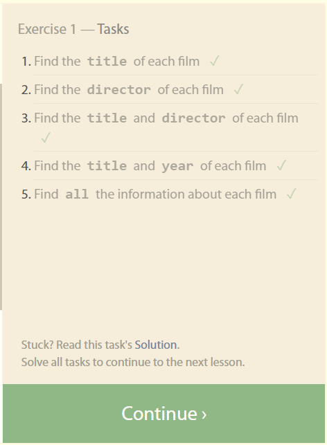
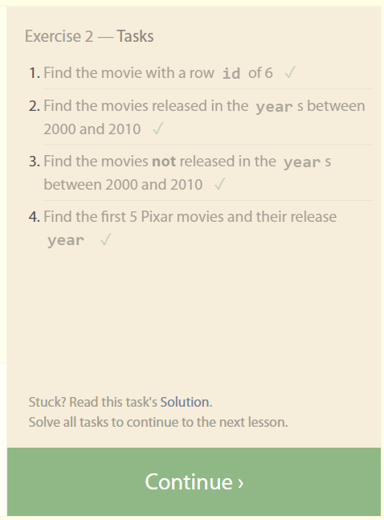
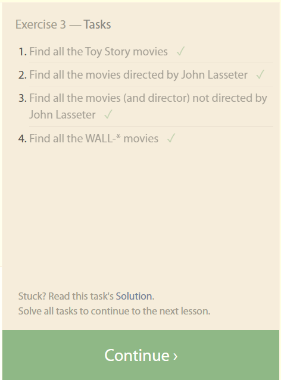
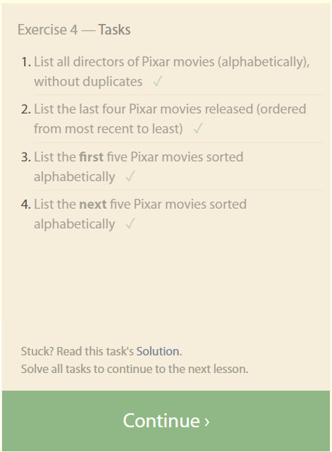
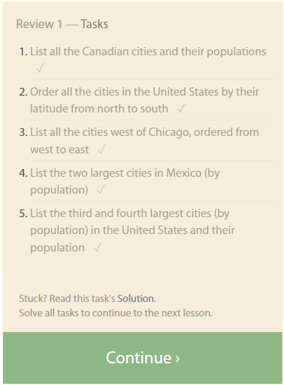
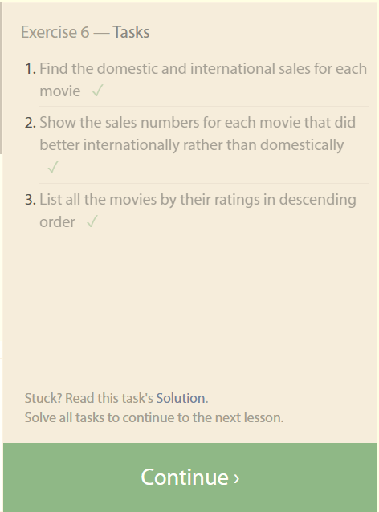
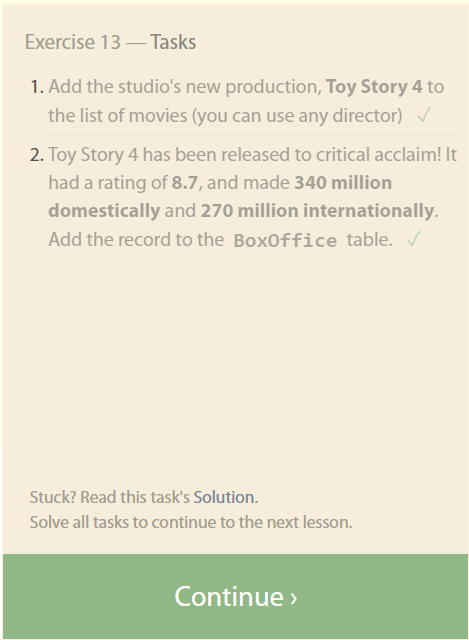
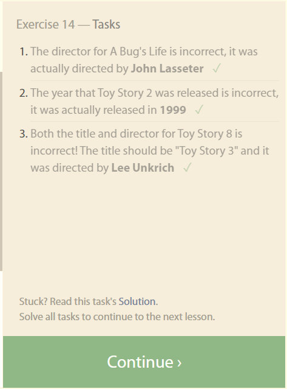
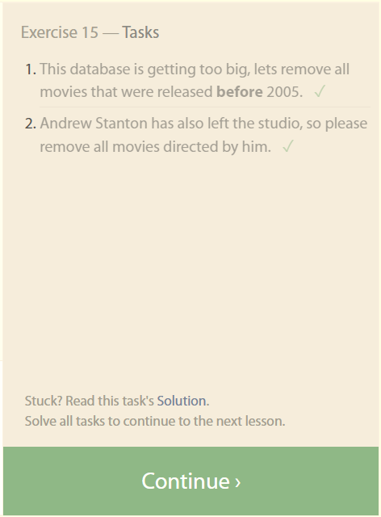
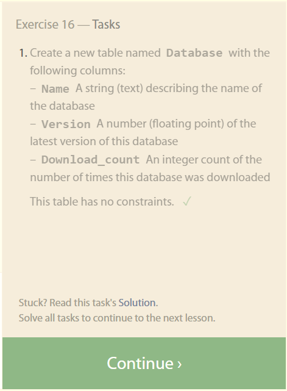
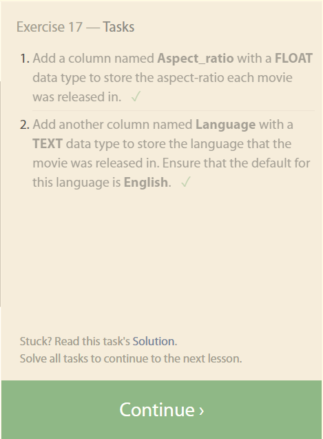
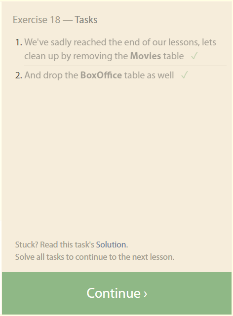
